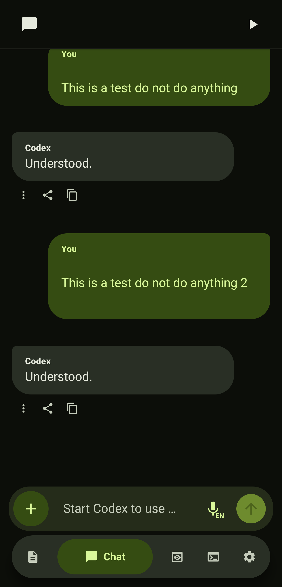
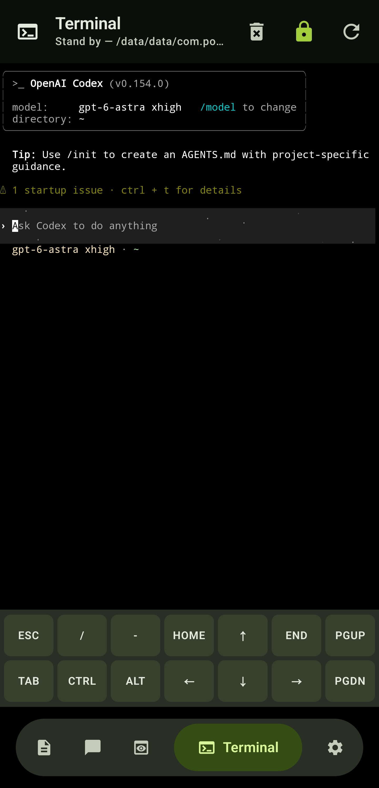
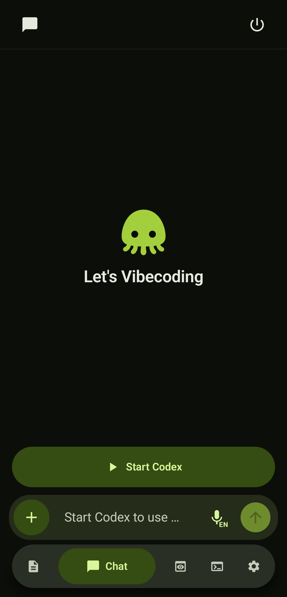
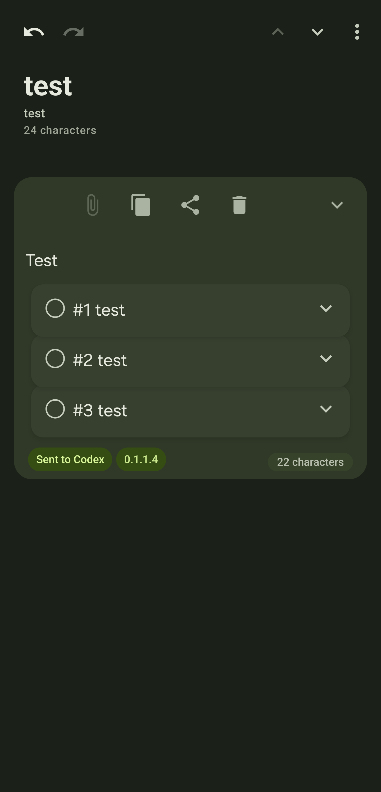
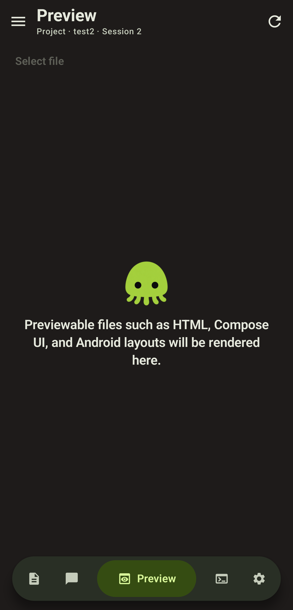
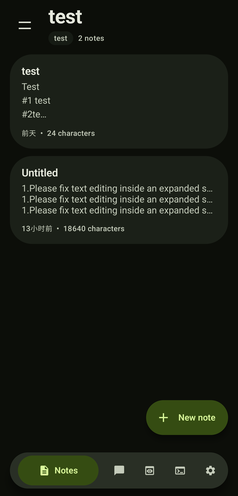
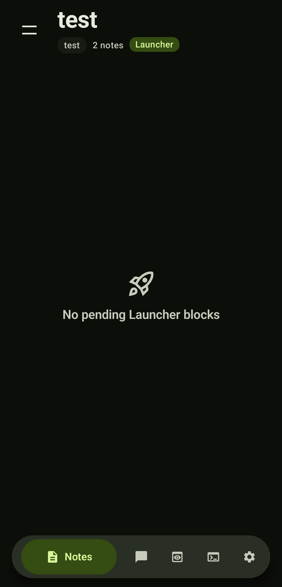
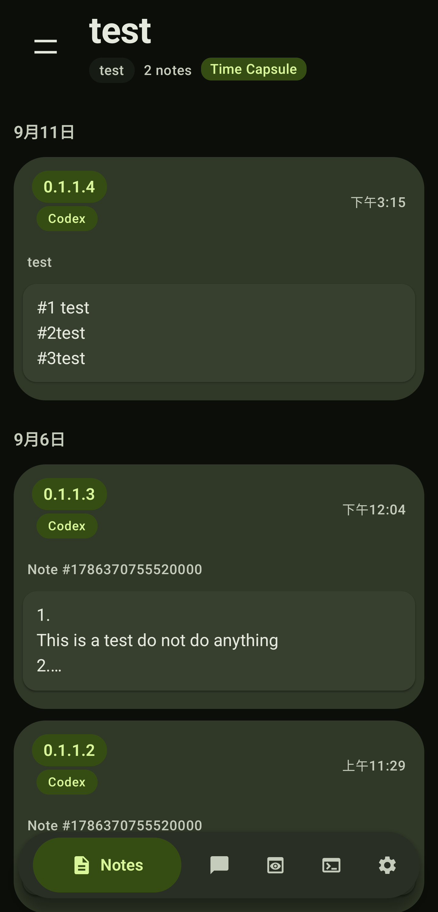
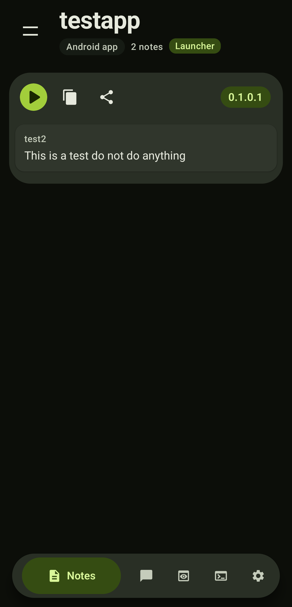
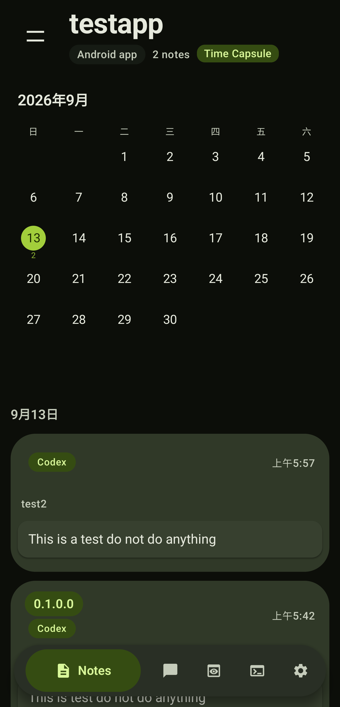

🤜[Support PokeCode on GoFundMe](https://gofund.me/9000cc699)

PokeCode is an independent project that I’m actively developing and maintaining. If you find the project useful, believe in what I’m building, or simply want to support its continued development, you can help by contributing to my GoFundMe.

Your support will help cover development costs, testing devices, better development hardware, and the time needed to keep improving PokeCode—including better support for foldable devices, AI-assisted development workflows, and new features.

Any amount of support is greatly appreciated and helps me spend more time making PokeCode better.


# Pokecode

Pokecode is an Android phone workspace for vibecoding with AI agents such as Codex. Organize notes and projects, prepare structured prompts, and build and iterate through Chat and an embedded terminal, with your development environment running locally on your phone.

## Overview

Keep written material in Notes, organize it into Blocks and Subblocks, and group work into Projects. Use Launcher and Time Capsule to manage submissions and revisit their saved history. Chat and Terminal bring command-line workflows into the same workspace.

This is Pokecode's public distribution and documentation repository. APK downloads belong in GitHub Releases; application source and development configuration are maintained privately.

## Prompt management

Use Notes as a working library for your prompts. Write instructions, split related tasks into Blocks and Subblocks, and organize them by Project. Reusable Custom Templates save common prompt instructions and version settings so you can apply them to future work.

Send a Block individually, or link several Blocks into a versioned group. Launcher lets you review pending groups before sending, while Time Capsule keeps snapshots of previous submissions so you can check exactly what was sent. Your working Notes and submission history stay accessible as you iterate with an AI agent.

## Main features

- Notes with editable Blocks and Subblocks, Cut/Paste, pinning, search, and progressive loading for large Notes.
- Project workspaces, Categories with selectable icons, and reusable templates with shared names.
- Launcher for preparing linked content and selecting multiple Blocks to unlink from a group while keeping the original Note content.
- Time Capsule for browsing saved submission snapshots by date.
- Trash with restoration of deleted Notes and Blocks.
- Export Notes as Word documents (`.docx`), UTF-8 text, or PDF.
- Chat sessions with attachments, a pen/eraser sketch editor, streamed responses, task controls, and interactive Codex follow-up questions.
- AI-assisted vibecoding with Codex in a local development environment on your Android phone.
- An embedded terminal with light and dark palettes, resumable initialization, and Codex/GitHub sign-in.
- Terminal settings for runtime updates, dependency repair, optional-plugin update warnings, and global Bun package updates that preserve Project dependencies.
- Phone file-access modes with verified Storage Helper installation, plus a Terminal wake-lock control for work with the screen off.
- Background backup and restore with progress notifications and cancellation controls.
- Session-scoped Preview for HTML/HTM and supported Android XML/Compose UI, with file selection and Start/Pause/Resume/Stop controls.
- Android App prompt Preview mode: complete and verify changes, then wait for explicit confirmation before building an APK.
- Light and dark themes and session progress notifications.

External services, accounts, downloaded tools, and model availability can affect individual workflows. Ubuntu and external AI services require separate setup; they are not provided by this repository.

Compiled Android previews require the Project's Gradle/JDK/Android SDK setup; XML also offers a limited draft renderer.

## Screenshots

Screenshots supplied by the author. Tap an image to view it at full size. The Preview screenshot shows an earlier interface; the current release uses the file picker and Start/Pause/Resume/Stop controls described above.

<table>
  <tr>
    <td align="center"><strong>1. Chat</strong><br><a href="screenshots/01-chat.png"></a></td>
    <td align="center"><strong>2. Terminal</strong><br><a href="screenshots/02-terminal.png"></a></td>
  </tr>
  <tr>
    <td align="center"><strong>3. Chat start</strong><br><a href="screenshots/03-chat-start.png"></a></td>
    <td align="center"><strong>4. Blocks and Subblocks</strong><br><a href="screenshots/04-note-blocks.png"></a></td>
  </tr>
  <tr>
    <td align="center"><strong>5. Preview (earlier interface)</strong><br><a href="screenshots/05-preview-earlier-ui.png"></a></td>
    <td align="center"><strong>6. Notes</strong><br><a href="screenshots/06-notes.png"></a></td>
  </tr>
  <tr>
    <td align="center"><strong>7. Launcher empty state</strong><br><a href="screenshots/07-launcher-empty.png"></a></td>
    <td align="center"><strong>8. Time Capsule history</strong><br><a href="screenshots/08-time-capsule-history.png"></a></td>
  </tr>
  <tr>
    <td align="center"><strong>9. Launcher prompt group</strong><br><a href="screenshots/09-launcher-group.png"></a></td>
    <td align="center"><strong>10. Time Capsule calendar</strong><br><a href="screenshots/10-time-capsule-calendar.png"></a></td>
  </tr>
</table>

## Download

Visit [Pokecode Releases](https://github.com/topoftree/PokeCodePublic/releases) for official APKs, release notes, SHA-256 checksums, and accompanying third-party materials.

Download [Pokecode-v0.1.6.8.16.apk](https://github.com/topoftree/PokeCodePublic/releases/download/v0.1.6.8.16/Pokecode-v0.1.6.8.16.apk) and [SHA256SUMS.txt](https://github.com/topoftree/PokeCodePublic/releases/download/v0.1.6.8.16/SHA256SUMS.txt) from the latest release. Review its known limitations and outstanding licensing issues before use. GitHub's automatically generated source-code archives contain this documentation repository, not the application or its complete third-party corresponding source.

## Latest release

The latest release is [**Pokecode 0.1.6.8.16**](https://github.com/topoftree/PokeCodePublic/releases/tag/v0.1.6.8.16) (Android version code **308**). The [Releases page](https://github.com/topoftree/PokeCodePublic/releases) is the authoritative record of available versions.

Changes since v0.1.6.8.6 include Launcher multi-selection and Unlink, Subblock Cut/Paste with `#number` support, and improved large-Note opening that no longer waits for the Notes collection. Chat exposes queued Codex follow-up choices and text inputs, and Block/group Send opens the matching Project conversation and starts its runtime when needed.

Settings → Terminal adds controlled phone file access and verified Storage Helper installation. Update now diagnoses Termux package errors and continues after optional plugin failures. Shared model-menu sizing, Settings captions, attachment press feedback and Note viewport behavior are also refined.

The Android runtime uses a compatibility execution path; its access boundaries are described under [Security and APK verification](#security-and-apk-verification). Third-party notice changes and existing obligations are documented in [THIRD_PARTY_NOTICES.md](THIRD_PARTY_NOTICES.md).

The application ID remains `com.pokecode`. Users of v0.1.6.4 can install this signed update over the existing app; older `com.claude.note` installations still need the migration below.

## Installation instructions

1. Open its release page and download `Pokecode-vX.Y.Z.apk` and `SHA256SUMS.txt`.
2. Verify the APK checksum as described below.
3. Open the APK using Android's file manager or your browser's download list.
4. If Android requests it, allow that browser or file manager to install unknown apps, then return to the installer.
5. Install and open Pokecode. You can turn off that installation permission afterward.

For a fresh environment, open Chat and select **Start initialization**, then follow setup and finish with **Sign in**, **Device code**, or **API key**. Setup requires internet access. AI services may also require an account and internet access even though the development environment runs locally on your phone.

Installation screens vary by manufacturer. If Android refuses the installation, check your Android version and CPU architecture before reporting the error. Do not disable Android's security checks to force an incompatible installation.

## Wake lock: work with the screen off

Pokecode's wake lock helps Terminal commands, builds and Codex tasks keep running while the phone's screen is off. In **Terminal**, a highlighted closed **lock icon** means it is enabled; tap the icon to toggle it. Starting a Terminal session enables it automatically. The screen can still turn off normally.

The wake lock expires after **two hours**; re-enable it if needed, and release it when work finishes to save battery. Android's [battery and background restrictions](https://developer.android.com/training/monitoring-device-state/doze-standby) can still limit processing or network access.

## Phone file access and Storage Helper

Choose **Settings → Terminal → File access**: **App sandbox only**, **Selected phone files**, or **All phone files**. Modes that require Storage Helper offer an Install/Update prompt if a compatible Helper is missing. Pokecode downloads the official compatible release, verifies its checksum, package/version and signing certificate, and opens Android's installer. After installation, it resumes the original permission request; cancellation or failure keeps the previous mode.

Selected files/folders and all-files access still require the normal Android permission choices. The separate [Storage Helper release](https://github.com/topoftree/PokeCodePublic/releases/tag/storage-helper-v1.0.0) remains available independently of the main app.

## Android requirements

| Requirement | Current release |
| --- | --- |
| Minimum Android version | Android 13 (API 33) |
| Target Android version | Android 16 (API 36) |
| CPU architecture | ARM64 (`arm64-v8a`) |
| Application ID | `com.pokecode` |
| Distribution build | Signed release APK |

Internet access is needed for external services and runtime downloads. Some features depend on capabilities available on the device. Downloaded Ubuntu environments need additional storage beyond the APK.

## Updating Pokecode

**Moving from v0.1.6.2.15 or another `com.claude.note` installation:** v0.1.6.4 and later use `com.pokecode` and install as a separate app, even though they retain the signing certificate.

1. In the old app, use **Settings → Back up** and save the selected categories to a shared folder such as **Download**.
2. Install the new APK, then use **Settings → Restore** in the new app to select that ZIP.
3. After validation, select the categories to restore. **Run in background** lets the operation continue while you navigate.
4. Check your Notes, Projects, Chat history, attachments, and runtime before deciding whether to remove the old app.

Restore replaces the selected categories in the new app. It does not automatically read or delete the old installation's private data. End-to-end migration on a device remains a manual validation item.

For updates from v0.1.6.4 or later with the same `com.pokecode` application ID, download the newer APK, verify its checksum, and install it over the existing app. Updates must have a compatible signing certificate; Android rejects updates signed with an unrelated key.

Export important Notes before updating. Avoid uninstalling to work around a signature error: uninstalling can remove application data. Report the error and the versions involved instead.

## Security and APK verification

Release 0.1.6.8.16 provides a `SHA256SUMS.txt` entry for the exact APK. In Termux or another shell with `sha256sum`, place the two downloaded files in the same directory and run:

```sh
sha256sum -c SHA256SUMS.txt
```

The result should say `OK` for the APK. A matching checksum confirms that the file matches the published bytes. It does not independently establish the publisher's identity; obtain both files from the official release page. Android also verifies the APK's signature during installation.

Managed Codex sessions run through Pokecode's Android/PRoot compatibility path. Commands can access files and network resources available to Pokecode, including its private files; this does not provide Linux workspace-only or read-only confinement. Android app permissions and the selected phone file-access mode remain the outer boundary. Codex approval choices do not expand the Storage Helper's grants.

## Bug reports

Search [existing issues](https://github.com/topoftree/PokeCodePublic/issues) before [opening a bug report](https://github.com/topoftree/PokeCodePublic/issues/new).

Include the Pokecode version, Android version, device model, steps to reproduce, and expected and actual behavior. Attach a redacted screenshot or error message when useful. Issues are public: remove passwords, tokens, account details, private notes, conversations, and other personal information before posting.

## Feature requests

[Open an issue](https://github.com/topoftree/PokeCodePublic/issues/new) describing the task you want to accomplish, the current limitation, and the behavior you would find useful. Suggestions do not imply a delivery commitment.

## Project status

Pokecode is under active development. This repository is its official public distribution channel. Release availability, changes, and known limitations are documented in GitHub Releases. Publication does not imply that the outstanding licensing review has been completed.

## Source code availability

Pokecode is proprietary software. This repository is provided for application distribution, documentation, release notes, and issue tracking. The application source code is not publicly available.

A public GitHub repository does not make Pokecode open source. No MIT, Apache, GPL, or other open-source license is granted for Pokecode itself by this repository. Third-party components retain their own licenses and recipient rights, including any applicable rights to their sources, modifications, and reverse engineering for debugging library modifications.

## Third-party open-source software

Pokecode uses third-party software under several licenses, including components that require source distribution. See [THIRD_PARTY_NOTICES.md](THIRD_PARTY_NOTICES.md) and [third_party_licenses/](third_party_licenses/) for component-specific notices and license texts.

The terminal runtime includes GPL, LGPL, and other copyleft components. The source-delivery and redistribution review remains incomplete: a complete corresponding-source package has not been published with this release, and LGPL replacement, execution-time notices, and SDK obligations remain unresolved. Publication does not establish compliance or remove those obligations. Required third-party source materials are distinct from Pokecode's private application source.

Google SDKs are covered by their own terms, rather than being presumed open source. ML Kit may send API performance and usage metrics to Google; see the [SDK notice](SDK_NOTICE.md). This notice describes those SDKs and is not a complete application privacy policy.

Pokecode is not affiliated with or endorsed by the projects or services mentioned here. Names and trademarks belong to their respective owners.

This product includes software developed by the University of California, Berkeley and its contributors.

## Copyright

Copyright © 2026 Pokecode. All rights reserved.

This notice applies to Pokecode's own material. It does not replace or restrict the licenses of the identified third-party components.
